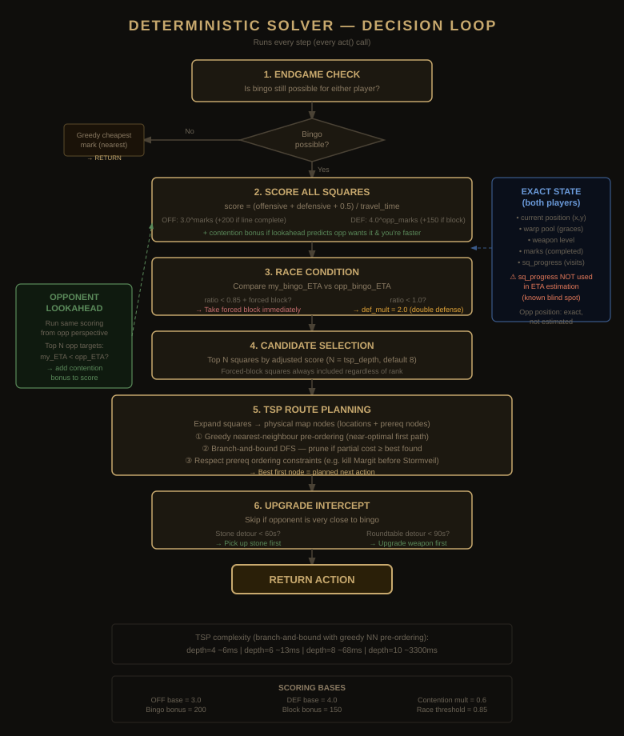

# DeterministicSolver

A TSP-based bingo route solver for Elden Ring S6 lockout bingo. No ML — pure heuristic planning.



---

## How it works

The solver runs its full decision loop on **every step** (every `act()` call). The loop has six stages:

### 1. Endgame check
If bingo is no longer mathematically possible for either player (every line is blocked), the game collapses to majority racing. The solver switches to **greedy cheapest-mark** mode: pick the nearest unmarked square by travel time. No complex planning needed.

### 2. Score all squares
Every available square (unmarked, not blocked, prereqs satisfiable) gets a **value density score**:

```
score = (offensive + defensive + 0.5) / estimated_time
```

- **Offensive** — exponential reward for your own line progress: `3.0 ^ marks_in_line`. Completing a line (4 → 5) gives a flat `+200` bonus.
- **Defensive** — steeper exponential for opponent's lines: `4.0 ^ opp_marks_in_line`. Blocking their 4-in-a-line gives `+150`.
- **Majority flat** — `0.5` constant so every mark always has some value.
- **Estimated time** — travel time from current position to nearest valid location + kill/action overhead (scaled by weapon level).

### 3. Opponent prediction (lookahead)
If `lookahead_depth > 0`, the solver runs the same scoring pipeline **from the opponent's perspective** to predict their top N targets. For each predicted target it compares ETAs:
- If you can reach it **before the opponent** → add a contention bonus (`opp_score × 0.6`) to your score for that square.

This gives pre-emptive blocking without explicit "should I block?" logic. Lookahead depth (1–3) controls how many opponent targets to predict.

### 4. Race condition
Compares `my_bingo_ETA` vs `opp_bingo_ETA` (time to complete cheapest remaining bingo line):

| Condition | Action |
|---|---|
| `opp_eta / my_eta < 0.85` AND forced block available | Take forced block immediately, skip all scoring |
| `opp_eta / my_eta < 1.0` | Set `def_mult = 2.0` — double all defensive weights |
| Otherwise | Normal balanced play (`def_mult = 1.0`) |

ETA is computed by summing `square_time_est` for all remaining squares on the cheapest open line. **Known limitation:** ETA does not account for partial `sq_progress` — a square that's 3/4 complete looks the same as a fresh square.

### 5. TSP route planning
The top-N candidate squares (N = `tsp_depth`, default 8) are expanded into physical map nodes (locations + prerequisite stops). The solver then finds the optimal visit order:

1. **Greedy nearest-neighbour pre-ordering** — starting from current position, always pick the closest unvisited node. This gives a near-optimal first path.
2. **Branch-and-bound DFS** — explore permutations, prune any branch whose partial cost already exceeds the best complete path found. The greedy pre-ordering means the first path explored is usually very close to optimal, so ~95% of branches are pruned immediately.
3. **Prereq constraints** — e.g., Margit must die before Stormveil locations can be used. Enforced via `needs_before` ordering in the DFS.

Returns the **first node** in the optimal permutation as the next action.

### 6. Upgrade intercept
After TSP picks the next destination, checks for opportunistic upgrade detours (skipped if opponent is very close to bingo):

- **Stone detour** — is the stone needed for the next weapon tier on the way? Detour cost < 60s → pick it up first.
- **Roundtable detour** — have enough stones to upgrade? Roundtable detour < 90s → upgrade weapon first.

---

## Parameters

| Parameter | Default | Description |
|---|---|---|
| `max_tsp_nodes` | 8 | Number of candidate squares entering TSP. Higher = better quality but exponentially slower. |
| `lookahead_depth` | 2 | Opponent moves to predict (0 = off). Adds contention bonus for squares you can reach before them. |

**TSP timing benchmarks** (per `act()` call, 30-game average):

| Depth | Mean | Notes |
|---|---|---|
| 4 | ~6ms | Fast, misses some routes |
| 6 | ~13ms | Good quality |
| 8 | ~68ms | Best balance (default) |
| 10 | ~3300ms | Slow — use only if you don't mind waiting |

---

## Scoring constants

| Constant | Value | Purpose |
|---|---|---|
| `OFF_BASE` | 3.0 | Exponential base for offensive line scoring |
| `DEF_BASE` | 4.0 | Exponential base for defensive scoring (steeper = more reactive) |
| `BINGO_WIN_BONUS` | 200 | Flat bonus for completing a line |
| `BLOCK_BONUS` | 150 | Flat bonus for blocking opponent's 4-in-a-line |
| `DEF_MULT_URGENT` | 2.0 | Defense multiplier when opponent ETA < yours |
| `RACE_THRESHOLD` | 0.85 | opp/my ETA ratio below which forced blocks override scoring |
| `CONTENTION_MULT` | 0.6 | Fraction of opponent's score added as contention bonus |
| `STONE_DETOUR_SEC` | 60 | Max extra seconds to detour for a stone pickup |
| `ROUNDTABLE_DETOUR_SEC` | 90 | Max extra seconds to detour for a weapon upgrade |

---

## Known limitations

- **ETA ignores `sq_progress`** — a square that's 3/4 complete looks identical to a fresh square in ETA and lookahead estimation. Mid-progress multi-visit squares (Bell Bearing Hunters, boss counts) can be underestimated as threats.
- **Single-ply lookahead** — predicts opponent's next target but doesn't simulate "if they go there, then I respond, then they respond." True minimax would catch the `sq_progress` blind spot naturally.
- **No day/night awareness** — Night's Cavalry and Deathbirds are night-only spawns. The solver has no clock and doesn't time arrivals.
- **Opponent position is exact** (not realistic for live play) — reads directly from shared sim state. A real-match companion would need to estimate from observable square completions.
